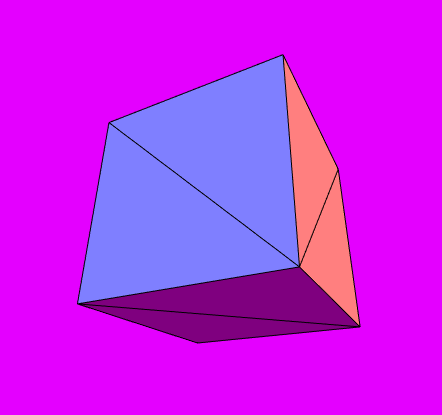
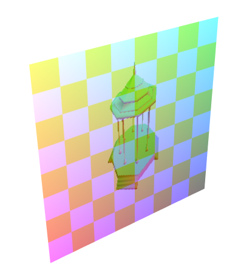
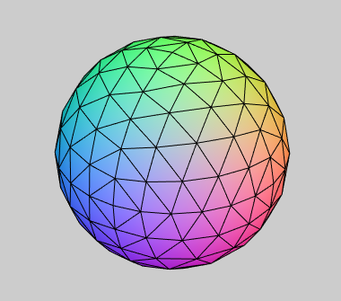

Expérimentation de script 3D exécutable sur un thread distinct du contexte HTML.

> !! Cette bibliothèque est un test d'apprentissage personnel, ne faites pas confiance à son bon fonctionnement !!

Exemple
-------

Cet exemple crée un simple cube rotatif.

https://corbane.github.io/g3/hello-world/



Fichier « `sketch.ts` »

```ts
/* sketch.ts */

/// autocomplétions
/// <reference no-default-lib="true"/>
/// <reference lib="webworker" />
/// <reference path="./g3-worker.d.ts" />

// Définitions d’un cube et de son shader dans la portée globale
const cube   = createBox ()
const shader = buitinShader ("uvColor")

// L'événement « OnSetup » est appelé une seule fois,
// après que toutes les ressources de portée globale soit chargées
OnSetup = function ()
{
    useCullFace ()

    usePerspectiveView (45, 0.1, 1000)

    useShader (shader, {
        a_vertex: cube.buffers.vertices,
        a_normal: cube.buffers.normals
    })
}

OnResize = function ()
{
    usePerspectiveView (45, 0.1, 1000)
}

OnDraw = function (milliseconds: number)
{
    // Nous allons faire tourner le cube de 45° par seconde
    const angle = radians (45) * (milliseconds / 1000)

    // Créer une page blanche
    clearView ()

    // Nous remettons les transformations cube a son emplacement de départ
    resetTransformations ()

    // Nous l’éloignions un peu de la camera
    translate (0, 0, -5)

    // Nous le faisons tourner
    rotateX (angle)
    rotateY (angle)

    // Puis un effet zoom
    scale (remap ([-1, 1], [0.1, 1.2], sin (angle)))

    // Nous mettons à jour le shader actif
    useShader(shader, {
        u_mvp     : getTransformsProjection (),
        brightness: 1
    })

    // Ici nous dessinons les faces du cube
    setDrawingMode ("triangles")
    drawMesh       (cube)

    // Nous re-mettons à jour le shader actif
    setShaderUniforms({
        brightness: 0
    })

    // Et ici nous dessinons les arrêtes du cube
    setDrawingMode ("lines")
    drawMesh       (cube)
}

// Lance l'animation du cube
play ()

```

Fichier « `index.html` »

```html
<!-- index.html -->
<!DOCTYPE html>
<html>
    <head>
        <style>
            canvas {
                width: 100%;
                height: 100vw;
            }
        </style>
        <script src="./g3.js"></script>
    </head>
    <body>
        <!-- L'attribut « data-sketch » peut définir un fichier Javascript ou Typescript.
            Dans le cas d'un fichier Typescript le code sera automatiquement compilé -->
        <canvas data-sketch="./sketch.ts"></canvas>
    </body>
</html>
```

Un exemple utilisant le rendu sur la texture.

https://corbane.github.io/g3/rtt/



Et un autre utilisant la communication d'événement utilisateur entre le thread HTML et le thread du script.

https://corbane.github.io/g3/camera/



